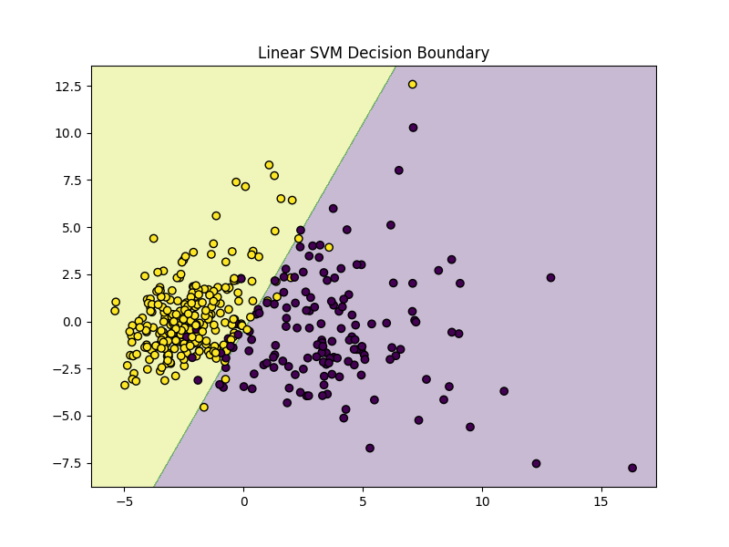

# Breast Cancer Detection using Support Vector Machines (SVM)

## 📖 Introduction
This project applies **Support Vector Machines (SVM)** to classify breast cancer tumors as malignant or benign.  
It demonstrates both **linear** and **RBF kernel** approaches, visualizes decision boundaries, and evaluates accuracy using cross-validation.  

---

## 🔗 Repository Link
[GitHub Repository](https://github.com/sudhatanmai/svm-classification-breast-cancer/tree/main)

---

## 🧰 Technologies & Libraries
- Python 3.x
- NumPy – numerical operations
- Scikit-learn – model training, dataset handling, preprocessing
- Matplotlib – visualizations
- PCA – dimensionality reduction for plotting

---

## 🛠 How It Works
1. Loads the **Breast Cancer dataset** from `sklearn.datasets`
2. Standardizes features with `StandardScaler`
3. Uses **PCA** to reduce features to 2 dimensions for visualization
4. Trains:
   - Linear Kernel SVM
   - RBF Kernel SVM
5. Plots decision boundaries for both models
6. Evaluates models using **5-fold cross-validation**

---

## 📷 Screenshots

